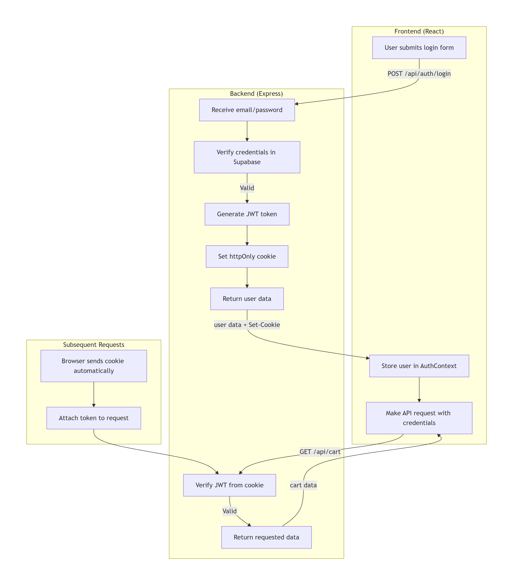
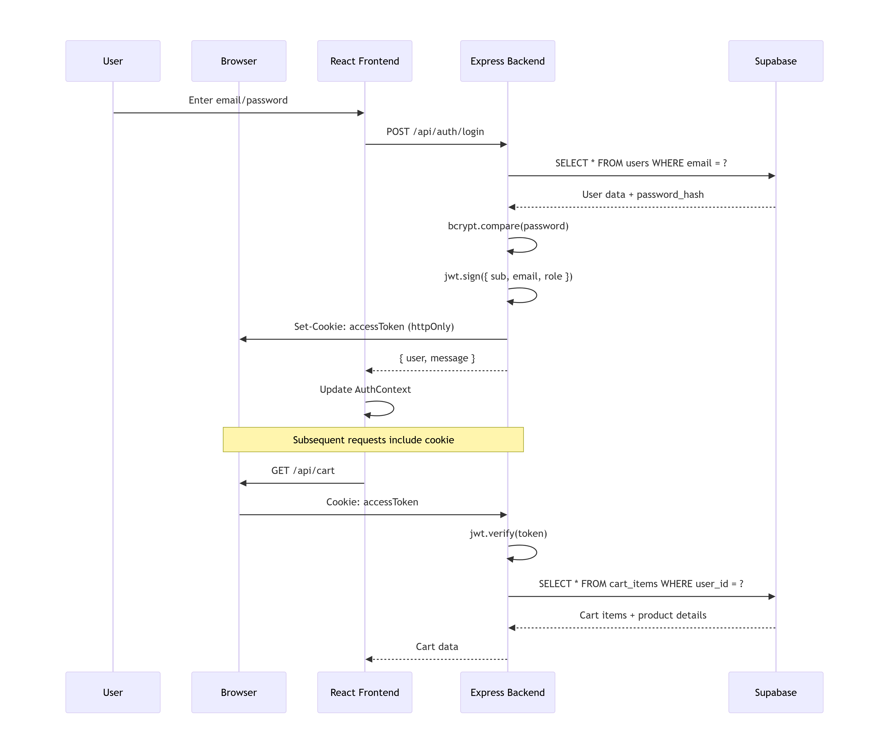
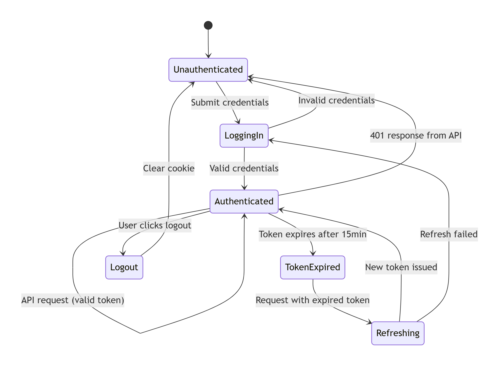

# Project Overview
### Features
SmokeBuddy Wholesale is a full-stack e-commerce platform for wholesale smoke products, featuring:
- Multi-role authentication (ADMIN, USER, SUBACCOUNT)
- Shopping cart with saved templates
- Order management system
- Team/sub-account management
- AI-powered chatbot assistant
- Responsive modern UI

### Pages
- **Home Page** - Hero section, featured products, new arrivals, best sellers, famous brands
- **Brand Products Page** - Filtered product listing by brand
- **Product Detail Page** - Product info, flavor selection, quantity controls, quote request
- **Login Page** - Wholesale customer login
- **Registration Page** - New wholesale account registration
- **Cart/Quote Page** - Request quote cart system
- **Contact Page** - Contact form and business info
- **Brands Page** - All brands organized by category

## Design Notes

- Clean, modern UI inspired by rzsmoke.com
- Minimal heavy animations
- Smooth hover effects and simple transitions
- Clear, readable fonts
- Easy-to-use interface for older users
- Desktop-first approach (wholesale business use)
- Mobile responsive

### Color Scheme

| Element | Color | Tailwind |
|---------|-------|----------|
| Primary | #3b82f6 | blue-600 |
| Hover | #1d4ed8 | blue-700 |
| Background | #f9fafb | gray-50 |
| Text | #111827 | gray-900 |
| Warning Background | #fef3c7 | yellow-50 |
| Warning Text | #92400e | yellow-800 |

### Responsive Breakpoints

| Screen | Breakpoint | Carousel Items |
|--------|------------|----------------|
| Desktop | > 1024px | 4 items |
| Tablet | 768px - 1024px | 3 items |
| Mobile Landscape | < 768px | 2 items |
| Mobile Portrait | < 640px | 1 item |

## Tech Stack

### Frontend

| Technology | Version | Purpose |
|------------|---------|---------|
| React | 18.x | UI Framework |
| TypeScript | 5.x | Type Safety |
| Redux Toolkit | 2.x | State Management (Cart) |
| React Router DOM | 6.x | Routing |
| Tailwind CSS | 3.x | Styling |
| Axios | 1.x | HTTP Client |
| Lucide React | - | Icons |
| Sonner | - | Toast Notifications |

### Backend

| Technology | Version | Purpose |
|------------|---------|---------|
| Node.js | 18+ | Runtime |
| Express | 4.x | Web Framework |
| Supabase | - | Database & Auth |
| JWT | 9.x | Authentication |
| Bcrypt | 5.x | Password Hashing |
| Multer | 1.x | File Uploads |
| Prisma | - | ORM (Partial) |


## Frontend Documentation
### Project Structure
```bash
wholesale-smoke-shop-website/
├── public/
│   └── (images only - excluded from structure)
│
├── src/
│   ├── app/
│   │   ├── components/
│   │   │   ├── home/
│   │   │   │   ├── FourFeatures.tsx
│   │   │   │   ├── HeroSection.tsx
│   │   │   │   ├── LogoMarquee.tsx
│   │   │   │   ├── QuickOrderModal.tsx
│   │   │   │   └── WhyChoseUS.tsx
│   │   │   │
│   │   │   ├── layout/
│   │   │   │   ├── Breadcrumbs.tsx
│   │   │   │   ├── Footer.tsx
│   │   │   │   ├── Header.tsx
│   │   │   │   ├── ScrollToTop.tsx
│   │   │   │   ├── SecondaryNavbar.tsx
│   │   │   │   └── TopWarningMarquee.tsx
│   │   │   │
│   │   │   └── ui/
│   │   │       ├── button.tsx
│   │   │       ├── card.tsx
│   │   │       ├── dialog.tsx
│   │   │       ├── form.tsx
│   │   │       ├── input.tsx
│   │   │       ├── modal.tsx (example)
│   │   │       └── (other shadcn/ui components)
│   │   │
│   │   ├── data/
│   │   │   ├── faqdata.ts
│   │   │   ├── fourfeaturesdata.ts
│   │   │   ├── heroslides.ts
│   │   │   └── secondaryNavbarData.ts
│   │   │
│   │   ├── pages/
│   │   │   ├── ContactPage.tsx
│   │   │   ├── FAQ.tsx
│   │   │   └── HomePage.tsx
│   │   │
│   │   ├── App.tsx
│   │   ├── hooks.ts
│   │   └── store.ts
│   │
│   ├── config/
│   │   └── config.ts
│   │
│   ├── features/
│   │   ├── account/
│   │   │   ├── api/
│   │   │   │   ├── account.api.ts
│   │   │   │   ├── address.api.ts
│   │   │   │   ├── credit.api.ts
│   │   │   │   ├── order.api.ts
│   │   │   │   └── team.api.ts
│   │   │   │
│   │   │   ├── components/
│   │   │   │   ├── tabs/
│   │   │   │   │   ├── AccountDetailsTab.tsx
│   │   │   │   │   ├── AddressesTab.tsx
│   │   │   │   │   ├── CreditTab.tsx
│   │   │   │   │   ├── OrdersTab.tsx
│   │   │   │   │   ├── PactTab.tsx
│   │   │   │   │   ├── PaymentsTab.tsx
│   │   │   │   │   ├── SavedCartsTab.tsx
│   │   │   │   │   └── TeamTab.tsx
│   │   │   │   │
│   │   │   │   ├── AddAddressForm.tsx
│   │   │   │   ├── AddMemberForm.tsx
│   │   │   │   └── OrderDetails.tsx
│   │   │   │
│   │   │   ├── hooks/
│   │   │   │   ├── useAddresses.ts
│   │   │   │   ├── useOrders.ts
│   │   │   │   ├── useTeam.ts
│   │   │   │   └── useUpdateProfile.ts
│   │   │   │
│   │   │   ├── pages/
│   │   │   │   └── AccountPage.tsx
│   │   │   │
│   │   │   └── types/
│   │   │       ├── account.types.ts
│   │   │       ├── address.types.ts
│   │   │       ├── order.types.ts
│   │   │       └── team.types.ts
│   │   │
│   │   ├── admin/
│   │   │   ├── api/
│   │   │   │   └── admin.service.ts
│   │   │   │
│   │   │   ├── components/
│   │   │   │   ├── AdminRoute.tsx
│   │   │   │   └── ProductManagement/
│   │   │   │       ├── ProductModal.tsx
│   │   │   │       └── ProductTable.tsx
│   │   │   │
│   │   │   └── pages/
│   │   │       ├── AdminDashboard.tsx
│   │   │       ├── FeaturesManagement.tsx
│   │   │       ├── ProductManagement.tsx
│   │   │       └── UserManagement.tsx
│   │   │
│   │   ├── auth/
│   │   │   ├── api/
│   │   │   │   └── auth.api.ts
│   │   │   │
│   │   │   ├── components/
│   │   │   │   └── ProtectedRoute.tsx
│   │   │   │
│   │   │   ├── context/
│   │   │   │   └── AuthContext.tsx
│   │   │   │
│   │   │   ├── pages/
│   │   │   │   ├── LoginPage.tsx
│   │   │   │   └── RegistrationPage.tsx
│   │   │   │
│   │   │   └── types/
│   │   │       └── auth.types.ts
│   │   │
│   │   ├── cart/
│   │   │   ├── api/
│   │   │   │   └── cartApi.ts
│   │   │   │
│   │   │   ├── hooks/
│   │   │   │   ├── useCartActions.ts
│   │   │   │   ├── useSaveCart.ts
│   │   │   │   └── useSavedCarts.ts
│   │   │   │
│   │   │   ├── pages/
│   │   │   │   └── CartPage.tsx
│   │   │   │
│   │   │   └── redux/
│   │   │       └── cartSlice.ts
│   │   │
│   │   ├── chatbot/
│   │   │   └── FloatingChatbot.tsx
│   │   │
│   │   ├── checkout/
│   │   │   ├── api/
│   │   │   │   └── paymentApi.ts
│   │   │   │
│   │   │   ├── hooks/
│   │   │   │   └── usePayment.ts
│   │   │   │
│   │   │   └── pages/
│   │   │       └── CheckoutPage.tsx
│   │   │
│   │   └── products/
│   │       ├── api/
│   │       │   ├── brandApi.ts
│   │       │   └── productApi.ts
│   │       │
│   │       ├── components/
│   │       │   ├── AddToCartButton.tsx
│   │       │   └── ProductCard.tsx
│   │       │
│   │       ├── hooks/
│   │       │   ├── useBrandProducts.ts
│   │       │   ├── useBrands.ts
│   │       │   ├── useHomeProducts.ts
│   │       │   ├── useProductDetails.ts
│   │       │   └── useProductsByCategory.ts
│   │       │
│   │       ├── pages/
│   │       │   ├── BrandList.tsx
│   │       │   ├── BrandProductsPage.tsx
│   │       │   ├── CategoryProductsPage.tsx
│   │       │   └── ProductDetailPage.tsx
│   │       │
│   │       ├── types/
│   │       │   ├── brand.types.ts
│   │       │   └── product.types.ts
│   │       │
│   │       └── utils/
│   │           └── getProductImage.ts
│   │
│   ├── lib/
│   │   └── supabase.ts
│   │
│   ├── styles/
│   │   ├── index.css (example)
│   │   └── (other CSS files excluded)
│   │
│   └── main.tsx
│
├── guidelines/
│   └── Guidelines.md
│
├── .gitignore
├── ATTRIBUTIONS.md
├── DEMO_INFO.md
├── index.html
├── package-lock.json
├── package.json
├── postcss.config.mjs
├── PROJECT_STRUCTURE.md
├── README.md
├── tsconfig.js
├── vercel.json
└── vite.config.ts
```

## API Reference

### Authentication Endpoints

| Method | Endpoint | Auth Required | Description |
|--------|----------|---------------|-------------|
| POST | `/api/auth/login` | No | Login with email/password |
| POST | `/api/auth/register` | No | Register new user |
| GET | `/api/auth/me` | Yes | Get current user |
| POST | `/api/auth/logout` | Yes | Logout |

### Account Endpoints

| Method | Endpoint | Auth Required | Description |
|--------|----------|---------------|-------------|
| PATCH | `/api/account/update-profile` | Yes | Update user profile |
| GET | `/api/account/my-sub-accounts` | Yes | Get team members |
| POST | `/api/account/add-subaccount` | Yes | Add team member |
| PATCH | `/api/account/update-subaccount-permission` | Yes | Toggle order permission |
| GET | `/api/account/my-history` | Yes | Get credit history |

### Address Endpoints

| Method | Endpoint | Auth Required | Description |
|--------|----------|---------------|-------------|
| GET | `/api/address` | Yes | Get all addresses |
| POST | `/api/address` | Yes | Add new address |
| DELETE | `/api/address/:id` | Yes | Delete address |
| PATCH | `/api/address/:id/default` | Yes | Set default address |

### Cart Endpoints

| Method | Endpoint | Auth Required | Description |
|--------|----------|---------------|-------------|
| GET | `/api/cart` | Yes | Get cart items |
| POST | `/api/cart/add` | Yes | Add/update item |
| DELETE | `/api/cart/:productId` | Yes | Remove item |
| POST | `/api/cart/save-cart-template` | Yes | Save cart as template |
| GET | `/api/cart/saved-cart-templates` | Yes | Get saved templates |

### Order Endpoints

| Method | Endpoint | Auth Required | Description |
|--------|----------|---------------|-------------|
| POST | `/api/orders/checkout` | Yes | Place order |
| GET | `/api/orders/my-orders` | Yes | Get order history |
| GET | `/api/orders/payment-history` | Yes | Get payment history |

### Product Endpoints (Public)

| Method | Endpoint | Description |
|--------|----------|-------------|
| GET | `/api/products/display` | Get brands |
| GET | `/api/products/home` | Get homepage products |
| GET | `/api/products/brand/:brand` | Get products by brand |
| GET | `/api/products/category/:category` | Get products by category |
| GET | `/api/products/product/:id` | Get single product |

### Admin Endpoints

| Method | Endpoint | Auth Required | Description |
|--------|----------|---------------|-------------|
| GET | `/api/admin/users` | ADMIN | Get all users |
| PATCH | `/api/admin/users/:id/role` | ADMIN | Update user role |
| DELETE | `/api/admin/users/:id` | ADMIN | Delete user |
| GET | `/api/admin/products` | ADMIN | Get products (paginated) |
| POST | `/api/admin/products` | ADMIN | Create product |
| PATCH | `/api/admin/products/:id` | ADMIN | Update product |
| DELETE | `/api/admin/products/:id` | ADMIN | Delete product |
| POST | `/api/admin/upload` | ADMIN | Upload product image |
| GET | `/api/admin/settings` | No | Get site settings |
| PATCH | `/api/admin/update-feature` | ADMIN | Update feature section |

## Database Schema (Supabase)

### Users Table

| Column | Type | Description |
|--------|------|-------------|
| `id` | bigserial PK | Primary key |
| `email` | string | User email (unique) |
| `password_hash` | string | Bcrypt hashed password |
| `email_verified` | boolean | Email verification status |
| `role` | enum | `ADMIN`, `USER` |
| `first_name` | string | User's first name |
| `last_name` | string | User's last name |
| `business_name` | string | Business/company name |
| `phone` | string | Contact phone |
| `parent_id` | bigint FK | References users.id (for sub-accounts) |
| `last_login` | timestamp | Last login timestamp |
| `created_at` | timestamp | Account creation date |
| `updated_at` | timestamp | Last update date |

### Sub-Accounts Table

| Column | Type | Description |
|--------|------|-------------|
| `id` | bigserial PK | Primary key |
| `user_id` | bigint FK | References users.id |
| `parent_id` | bigint FK | References owner user |
| `permissions` | jsonb | `{ can_place_order: boolean }` (default: true) |
| `created_at` | timestamptz | Creation date |
| `updated_at` | timestamptz | Last update date |

### Brands Table

| Column | Type | Description |
|--------|------|-------------|
| `id` | serial PK | Primary key |
| `name` | string | Brand name (unique) |

### Addresses Table

| Column | Type | Description |
|--------|------|-------------|
| `id` | bigserial PK | Primary key |
| `user_id` | bigint FK | References users.id |
| `address_type` | enum | `shipping`, `billing` |
| `is_default` | boolean | Default address flag |
| `full_name` | string | Recipient full name |
| `company_name` | string | Company name (optional) |
| `address_line1` | string | Street address |
| `address_line2` | string | Apartment/suite (optional) |
| `city` | string | City |
| `state` | string | State |
| `postal_code` | string | ZIP code |
| `country` | string | Country (default: USA) |
| `phone` | string | Contact phone |
| `created_at` | timestamp | Creation date |

### Cart Items Table

| Column | Type | Description |
|--------|------|-------------|
| `id` | bigserial PK | Primary key |
| `user_id` | bigint FK | References users.id |
| `product_id` | bigint FK | References products.id |
| `quantity` | integer | Quantity in cart (minimum 1) |
| `created_at` | timestamp | Creation date |
| `updated_at` | timestamp | Last update date |
| **Constraint** | unique | `(user_id, product_id)` |

### Saved Carts Table

| Column | Type | Description |
|--------|------|-------------|
| `id` | bigserial PK | Primary key |
| `user_id` | bigint FK | References users.id |
| `cart_name` | string | User-defined name |
| `items` | jsonb | Array of cart items |
| `total_amount` | decimal | Cart total (default: 0.00) |
| `created_at` | timestamptz | Save date |

### Orders Table

| Column | Type | Description |
|--------|------|-------------|
| `id` | bigserial PK | Primary key |
| `user_id` | bigint FK | References users.id |
| `shipping_address_id` | bigint FK | References addresses.id |
| `billing_address_id` | bigint FK | References addresses.id |
| `business_name` | string | Business name for order |
| `total_amount` | decimal | Order total (default: 0.00) |
| `status` | text | `pending`, `processing`, `completed`, `cancelled` (default: pending) |
| `created_at` | timestamp | Order date |

### Order Items Table

| Column | Type | Description |
|--------|------|-------------|
| `id` | bigserial PK | Primary key |
| `order_id` | bigint FK | References orders.id (Cascade delete) |
| `product_id` | bigint FK | References products.id |
| `quantity` | integer | Quantity ordered |
| `price_at_time` | decimal | Price when ordered |
| `flavor` | string | Selected flavor (optional) |
| `created_at` | timestamp | Creation date |

### Payment History Table

| Column | Type | Description |
|--------|------|-------------|
| `id` | bigserial PK | Primary key |
| `user_id` | bigint FK | References users.id |
| `order_id` | bigint FK | References orders.id |
| `amount` | decimal | Payment amount |
| `transaction_id` | string | Payment gateway ID (unique) |
| `payment_method` | string | Payment method used |
| `status` | string | Payment status |
| `created_at` | timestamp | Payment date |

### Credit History Table

| Column | Type | Description |
|--------|------|-------------|
| `id` | bigserial PK | Primary key |
| `user_id` | bigint FK | References users.id |
| `order_id` | bigint FK | References orders.id |
| `amount` | decimal | Credit amount |
| `reason` | string | Reason for credit |
| `status` | string | Credit status |
| `created_at` | timestamp | Creation date |

### Wishlist Items Table

| Column | Type | Description |
|--------|------|-------------|
| `id` | bigserial PK | Primary key |
| `user_id` | bigint FK | References users.id (Cascade delete) |
| `product_id` | bigint FK | References products.id |
| `created_at` | timestamp | Creation date |
| **Constraint** | unique | `(user_id, product_id)` |

## Authentication Flow
The application uses JWT-based authentication with HTTP-only cookies for secure session management. This approach prevents XSS attacks while maintaining a seamless user experience.

### How Authentication Works
1. Login Process: User submits email and password to the backend
2. Token Generation: Upon successful verification, a JWT token is signed and stored in an HTTP-only cookie
3. Automatic Inclusion: All subsequent API requests automatically include the cookie
4. Token Validation: The verifyTokenFromCookie middleware validates the token on protected routes
5. Session Expiry: Tokens expire after 15 minutes, requiring re-authentication

### Authentication Flow Diagram
The diagram below illustrates the complete login and request flow between frontend, backend, and database:


### Detailed Sequence Flow
The sequence diagram provides a step-by-step breakdown of the authentication process and subsequent authenticated requests:


### Session State Management
The state diagram shows the various authentication states a user can experience:


## Setup & Installation

### Prerequisites

- Node.js 18+
- npm or yarn
- Supabase account (for database)
- Git

### Frontend Setup
### Clone repository
```bash
git clone https://github.com/yourusername/smokebuddy-frontend.git
cd smokebuddy-frontend
```
### Install dependencies
```bash
npm install
```
### Create .env file
```bash
echo "VITE_API_URL=http://localhost:5000/api" > .env
echo "VITE_CHATBOT_URL=http://localhost:8000" >> .env
```
### Start development server
```bash
npm run dev
```
### Backend Setup 
### Clone repository
```bash
git clone https://github.com/yourusername/smokebuddy-backend.git
cd smokebuddy-backend
```
### Install dependencies
```bash
npm install
```
### Create .env file
```bash
cat > .env << EOF
PORT=5000
JWT_SECRET=your_jwt_secret_key_here
SUPABASE_URL=your_supabase_url
SUPABASE_ANON_KEY=your_supabase_anon_key
SUPABASE_SERVICE_ROLE_KEY=your_supabase_service_role_key
CLIENT_URL=http://localhost:5173
EOF
```

### Start development server
```bash
npm run dev
```
---

### Environment Variables

#### Backend (.env)
| Variable | Required | Default | Description |
|----------|----------|---------|-------------|
| `PORT` | Yes | 5000 | Server port |
| `JWT_SECRET` | Yes | - | Secret for JWT signing (min 32 chars) |
| `SUPABASE_URL` | Yes | - | Your Supabase project URL |
| `SUPABASE_ANON_KEY` | Yes | - | Supabase anonymous key |
| `SUPABASE_SERVICE_ROLE_KEY` | Yes | - | Supabase admin key (for storage) |
| `CLIENT_URL` | Yes | http://localhost:5173 | Frontend URL for CORS |

#### Frontend (.env)
| Variable | Required | Default | Description |
|----------|----------|---------|-------------|
| `VITE_API_URL` | Yes | http://localhost:5000/api | Backend API endpoint |
| `VITE_CHATBOT_URL` | No | - | AI chatbot service URL |

## Key Frontend Patterns

### API Client Configuration

```typescript
export const apiClient = axios.create({
  baseURL: API_URL,
  withCredentials: true,  
});
apiClient.interceptors.response.use(
  (response) => response,
  (error) => {
    if (error.response?.status === 401) {
      window.location.href = "/login";
    }
    return Promise.reject(error);
  }
);
```
### Auth Context Usage

```typescript
<AuthProvider>
  <App />
</AuthProvider>
const { user, login, logout, loading } = useAuth();
```

### Redux Cart Slice
```bash
export const fetchCart = createAsyncThunk("cart/fetch", async () => {
  const response = await api.get("/cart/");
  return response.data;
});
dispatch(fetchCart());
```
### Custom Hooks Available

| Hook | Purpose |
|------|---------|
| `useCartActions()` | Cart operations with optimistic updates |
| `useAddresses()` | Address CRUD operations |
| `useTeam()` | Sub-account management |
| `useOrders()` | Order history fetching |
| `useUpdateProfile()` | Profile update with optimistic UI |
| `useSaveCart()` | Save cart as template |
| `useBrandProducts()` | Filter products by brand |
| `useHomeProducts()` | Fetch homepage product sections |

### Deployment
### Frontend (Vercel)
```bash
# Install Vercel CLI
npm i -g vercel

# Deploy
vercel --prod

# Environment variables in Vercel dashboard:
# VITE_API_URL=https://your-backend.railway.app/api
# VITE_CHATBOT_URL=https://your-chatbot-url
```
### Backend (Railway)
```bash
# Connect GitHub repo to Railway
# Add environment variables in Railway dashboard
# Deploy from main branch
```
### Supabase Setup
1. Create new Supabase project
2. Run the schema SQL (provided above)
3. Enable Row Level Security (RLS)
4. Set up storage buckets:
    - product-images - for product photos
    - site-assets - for hero/feature images
  
## Security Considerations

1. HTTP-only cookies for JWT storage
2. Bcrypt for password hashing (10 rounds)
3. CORS restricted to trusted origins
4. Row Level Security (RLS) in Supabase
5. Input validation on all endpoints
6. Environment variables for secrets


## License

MIT License - See LICENSE file for details

## Contributors

Muhammad Ali Naseem- Lead Developer

## Support

For issues or questions:

- GitHub Issues
- Email: alinaseem21102002@gmail.com

## Project Status

### Completed Features
- [x] User authentication (JWT + cookies)
- [x] Role-based access (ADMIN/USER/SUBACCOUNT)
- [x] Product catalog with filtering
- [x] Shopping cart with persist
- [x] Saved cart templates
- [x] Address management
- [x] Order placement & history
- [x] Team/sub-account management
- [x] Admin dashboard
- [x] AI chatbot integration

### In Progress
- [ ] Payment gateway integration
- [ ] Order tracking system

### Planned
- [ ] Product reviews & ratings
- [ ] Email notifications
- [ ] Bulk order CSV import
- [ ] Mobile app (React Native)
- [ ] Real-time inventory
- [ ] Analytics dashboard
